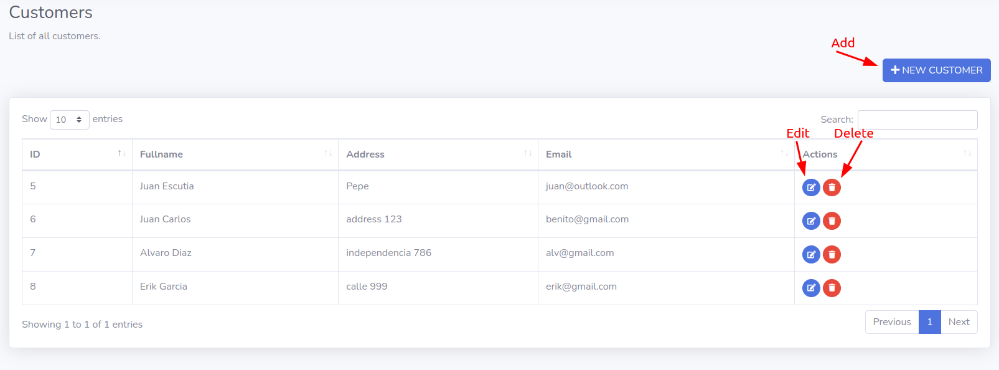
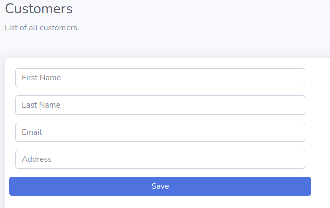

# Crud
This is a simple CRUD using Springboot and mySQL

Also contains a Frontend with a Bootstrap template, using JavaScript

To run the app you have to run Xampp with MySQL Database and Apache Web Server

At application.properties make sure to configure the right port for mysql (3306 or 3307)

Also create the database with phpmyadmin and set the correct url, username and password at application.properties (by default DB username is root and doesn't have password)

The frontend is at src/main/resources/static

